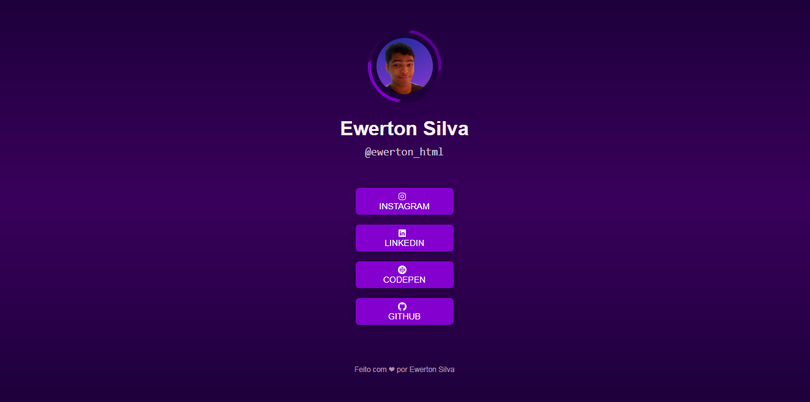

# Bio Link




> Este projeto tem como objetivo de reaunir todos os links em um inico lugar para falicitar o acesso, principalmente quando há um limite de quantidades de links que podem usar
> 
## 🔨 Ajustes e melhorias

O projeto ainda está em desenvolvimento e as próximas atualizações serão voltadas nas seguintes tarefas:

- [ ] Botão de mudança de tema

## 🖥 Tecnologias


<br/>

## 🚀 Instalando Calculator

Para instalar o Calculator, siga estas etapas:

1. Instale [git](https://git-scm.com/downloads) no seu aparelho
2. Abrir o git bash no local da sua preferencia
3. Use os seguintes comandos
```
$ git init
$ git clone https://github.com/ewerton-html/bio-link.git
```
Caso tenha alguma duvida, consulte a documentação do GitHub em [como clonar um repositório](https://docs.github.com/pt/repositories/creating-and-managing-repositories/cloning-a-repository).

## 👥 Autores

<table>
  <tr>
    <td align="center">
      <a href="https://github.com/ewerton-html">
        <br>
        <sub>
          <b>ewerton-html</b>
        </sub>
      </a>
    </td>
  </tr>
</table>

## 🧾 Licença

Esse projeto está sob licença. Veja o arquivo [LICENÇA](./LICENSE) para mais detalhes.

[⬆ Voltar ao topo](#bio-link)<br>
